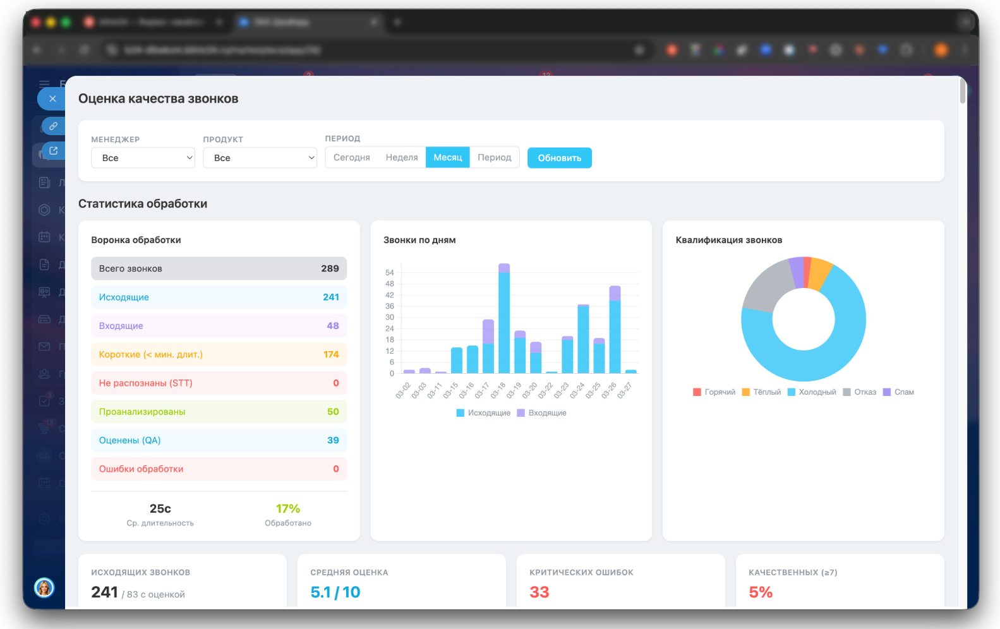
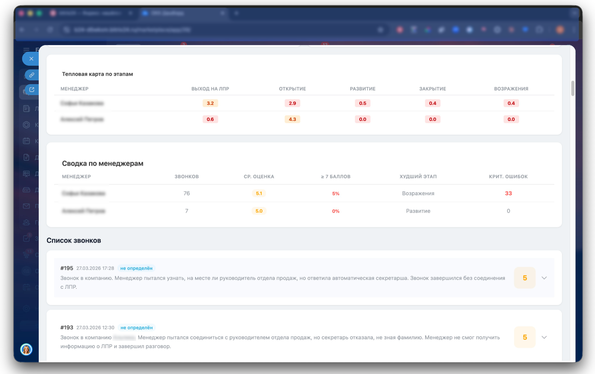
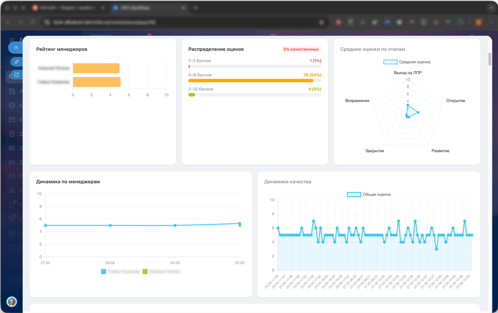
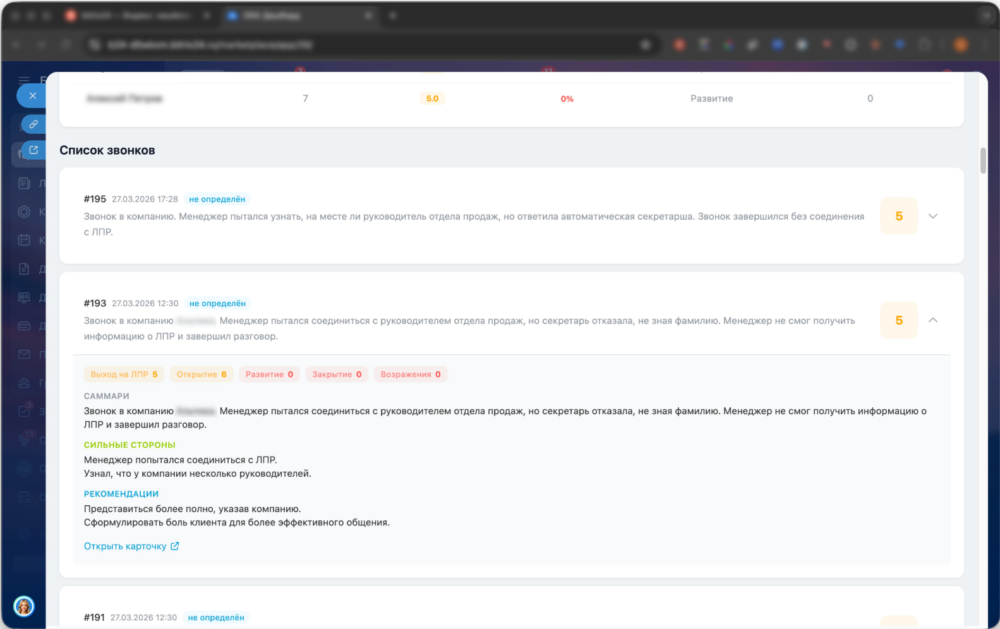

# Call AI Pipeline

Automated phone call processing pipeline that downloads recordings, transcribes them, analyzes with LLM, and pushes results to CRM.

## Architecture

```
Novofon Webhook → FastAPI → Redis Queue → arq Worker → Pipeline
                                                         │
                                          ┌──────────────┼──────────────┐
                                          ▼              ▼              ▼
                                     Download       Transcribe      Analyze
                                    (Novofon)     (YandexSTT)    (LLM via API)
                                          │              │              │
                                          ▼              ▼              ▼
                                     Upload S3     Save transcript  CRM update
                                                                   (Bitrix24)
                                                                       │
                                                                       ▼
                                                                  QA scoring
                                                               (smart process)
```

### Pipeline Stages

1. **Webhook** — receives call completion event from Novofon PBX
2. **Download** — fetches MP3 recording via Novofon Data API 2.0
3. **Upload** — stores recording in Yandex Object Storage (S3)
4. **Transcribe** — speech-to-text via Yandex SpeechKit (async recognition)
5. **Analyze** — LLM extracts summary, qualification, product, and conversation quality scores
6. **CRM** — creates/updates company, deal, and timeline comment in Bitrix24
7. **QA** — creates quality assessment item in Bitrix24 smart process with per-stage scores

### Key Features

- **Idempotent processing** — deduplication via Redis keys (7-day TTL)
- **Retry with backoff** — transient errors retry via arq, permanent errors go to DLQ
- **Deferred deal binding** — if no deal exists at processing time, retries CRM binding on a schedule
- **Rate limiting** — built-in Bitrix24 API rate limiter with 429 handling
- **Structured logging** — JSON logs via structlog
- **Graceful shutdown** — all HTTP clients properly closed on SIGTERM
- **Dashboard** — Vue 3 + Chart.js analytics dashboard with manager rankings and call stats

## Dashboard

Analytics dashboard built with Vue 3 + Chart.js.



<details>
<summary>More screenshots</summary>







</details>

## Tech Stack

- **API:** FastAPI + uvicorn
- **Worker:** arq (async Redis-based task queue)
- **STT:** Yandex SpeechKit (async batch recognition)
- **LLM:** OpenAI-compatible API (via ProxyAPI)
- **CRM:** Bitrix24 REST API
- **PBX:** Novofon Data API 2.0
- **Storage:** Yandex Object Storage (S3-compatible)
- **Queue/Cache:** Redis 7
- **Dashboard:** Vue 3, Chart.js, Vite
- **Infra:** Docker, Docker Compose, multi-stage builds

## Quick Start

```bash
# 1. Clone and configure
cp .env.example .env
# Fill in all required values in .env

# 2. Place Yandex Cloud service account key
# Download from IAM console → save as service_account_key.json

# 3. Run
docker-compose up -d

# 4. Verify
curl http://localhost:8010/health
```

## Project Structure

```
app/
├── main.py            # FastAPI app: webhook, health, admin, stats endpoints
├── worker.py          # arq worker: task handlers, startup/shutdown lifecycle
├── pipeline.py        # Main processing pipeline orchestrator
├── config.py          # Pydantic settings (env-based configuration)
├── stats.py           # Redis-based daily call statistics
├── exceptions.py      # Custom exception hierarchy
├── crm/
│   └── bitrix24.py    # Bitrix24 REST API client
├── llm/
│   ├── base.py        # Abstract LLM client interface
│   └── proxyapi_client.py  # OpenAI-compatible LLM client
├── models/
│   ├── schemas.py     # Core data models (CallData, LLMResponse, etc.)
│   └── qa_schemas.py  # QA scoring models
├── novofon/
│   ├── api.py         # Novofon Data API 2.0 client
│   └── webhook.py     # Webhook payload parser
└── stt/
    ├── s3.py          # S3-compatible storage client
    └── speechkit.py   # Yandex SpeechKit async recognition

dashboard/             # Vue 3 analytics dashboard
scripts/               # Utility scripts (backfill, testing)
tests/                 # pytest test suite
```

## API Endpoints

| Method | Path | Auth | Description |
|--------|------|------|-------------|
| GET | `/health` | — | Health check (Redis ping) |
| POST | `/webhook` | `?secret=` | Novofon webhook receiver |
| GET | `/api/stats?days=30` | — | Call statistics (daily + totals) |
| GET | `/admin/failed` | Bearer token | List DLQ entries |
| POST | `/admin/retry/{call_id}` | Bearer token | Re-enqueue failed call |

## License

MIT
